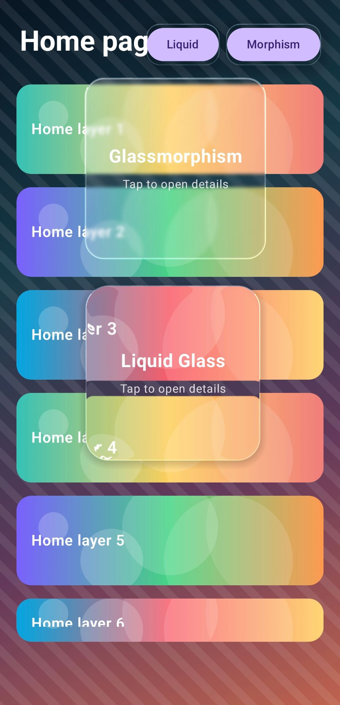

# Liquidmorphism

Liquidmorphism is a Kotlin Multiplatform Compose glass and liquid glass effects library.

## Screenshot



## Versions

Use the version that matches your project type:

```text
1.0.2: Android-only Jetpack Compose projects
1.0.5: Kotlin Multiplatform Compose projects
```

## Installation

Add JitPack to `settings.gradle.kts`:

```kotlin
dependencyResolutionManagement {
    repositories {
        google()
        mavenCentral()
        maven("https://jitpack.io")
    }
}
```

### Android-only

Use `1.0.2` for regular Android Jetpack Compose projects:

```kotlin
dependencies {
    implementation("com.github.Amin-asvadi:liquidmorphism:1.0.2")
}
```

### Kotlin Multiplatform

Use `1.0.5` for Kotlin Multiplatform Compose projects.

If you use a version catalog, add this to `gradle/libs.versions.toml`:

```toml
[versions]
liquidmorphism = "1.0.5"

[libraries]
liquidmorphism = { module = "com.github.Amin-asvadi.liquidmorphism:glass", version.ref = "liquidmorphism" }
```

Then add it to `commonMain` in your shared module:

```kotlin
kotlin {
    sourceSets {
        commonMain.dependencies {
            api(libs.liquidmorphism)
        }
    }
}
```

You can also add it directly without a version catalog:

```kotlin
kotlin {
    sourceSets {
        commonMain.dependencies {
            api("com.github.Amin-asvadi.liquidmorphism:glass:1.0.5")
        }
    }
}
```

Supported targets:

```text
Android: native liquid glass shader on Android 13+ with Compose fallback on older versions
iOS Compose Multiplatform: Compose fallback glass rendering
iOS SwiftUI: native Liquid Glass on iOS 26+ with SwiftUI Material fallback on iOS 15+
```

## SwiftUI iOS Native Usage

This repository also ships a native SwiftUI package product:

```text
LiquidmorphismSwiftUI
```

Add this repository in Xcode:

```text
File > Add Package Dependencies > https://github.com/Amin-asvadi/liquidmorphism
```

Then import the SwiftUI product:

```swift
import SwiftUI
import LiquidmorphismSwiftUI
```

### SwiftUI Liquid Glass

`liquidGlass()` uses Apple's native `glassEffect` on iOS 26+ and falls back to
the library's SwiftUI glassmorphism material on older iOS versions.

```swift
Text("Open Detail")
    .font(.title2.weight(.semibold))
    .foregroundStyle(.primary)
    .frame(width: 200, height: 200)
    .liquidGlass(
        .init(
            cornerRadius: 40,
            tint: .cyan.opacity(0.18),
            interactive: true
        )
    )
```

### SwiftUI Glassmorphism

```swift
Text("Glass")
    .font(.title.weight(.bold))
    .frame(width: 200, height: 200)
    .glassmorphism(
        .init(
            cornerRadius: 36,
            tint: .white,
            tintOpacity: 0.18,
            strokeOpacity: 0.38,
            highlightOpacity: 0.34,
            shadowOpacity: 0.16,
            frostedNoiseEnabled: true,
            frostedNoiseOpacity: 0.12
        )
    )
```

### SwiftUI Navigation Sample

```swift
struct HomeScreen: View {
    var body: some View {
        NavigationStack {
            ZStack {
                Image("home_bg")
                    .resizable()
                    .scaledToFill()
                    .ignoresSafeArea()

                NavigationLink {
                    DetailScreen()
                } label: {
                    Text("Open Detail")
                        .frame(width: 200, height: 200)
                        .liquidGlass(.init(cornerRadius: 40, tint: .cyan.opacity(0.18)))
                }
            }
        }
    }
}

struct DetailScreen: View {
    var body: some View {
        ZStack {
            Image("detail_bg")
                .resizable()
                .scaledToFill()
                .ignoresSafeArea()

            Text("Detail")
                .frame(width: 200, height: 200)
                .glassmorphism(.init(cornerRadius: 100, frostedNoiseEnabled: true))
        }
    }
}
```

For multiple Liquid Glass elements on iOS 26+, wrap them in `LiquidGlassContainer`
to let SwiftUI combine and morph the effects efficiently.

## Usage

### Kotlin Multiplatform Setup

Put shared UI code in your shared module's `commonMain` source set, then use the same composables on Android and iOS:

```text
shared/src/commonMain/kotlin/your/package/SharedGlassScreen.kt
```

```kotlin
package your.package

import androidx.compose.foundation.layout.Box
import androidx.compose.foundation.layout.fillMaxSize
import androidx.compose.foundation.layout.size
import androidx.compose.foundation.shape.RoundedCornerShape
import androidx.compose.runtime.Composable
import androidx.compose.ui.Modifier
import androidx.compose.ui.graphics.Color
import androidx.compose.ui.unit.dp
import com.liquidmorphism.glass.GlassBackdropProvider
import com.liquidmorphism.glass.drawBackdrop
import com.liquidmorphism.glass.glassmorphism
import com.liquidmorphism.glass.parentGlass
import com.liquidmorphism.glass.rememberGlassBackdrop

@Composable
fun SharedGlassScreen() {
    val backdrop = rememberGlassBackdrop()

    GlassBackdropProvider(backdrop) {
        Box(
            modifier = Modifier
                .fillMaxSize()
                .parentGlass()
        ) {
            Box(
                modifier = Modifier
                    .size(220.dp)
                    .drawBackdrop(
                        shape = { RoundedCornerShape(32.dp) },
                        effects = {
                            blur(16f)
                            scale(0.55f)
                            centerDistortion(0.35f)
                            elevation(12.dp)
                            tint(Color.White.copy(alpha = 0.10f))
                            darkness(0.08f)
                            warpEdges(0.25f)
                        }
                    )
            )

            Box(
                modifier = Modifier
                    .size(260.dp, 180.dp)
                    .glassmorphism(
                        shape = { RoundedCornerShape(32.dp) },
                        effects = {
                            blur(28f)
                            elevation(18.dp)
                            tint(Color.White.copy(alpha = 0.18f))
                            frosted(enabled = true, intensity = 0.55f)
                        }
                    )
            )
        }
    }
}
```

Android uses the native shader effect on Android 13+ and falls back to Compose drawing on older Android versions. iOS uses the Compose fallback implementation.

### Liquid Glass

Use `Modifier.parentGlass()` or `Modifier.layerBackdrop()` on the parent container that should provide the backdrop, then use `Modifier.drawBackdrop()` on each liquid glass layer.

```kotlin
@Composable
fun LiquidGlassSample() {
    val backdrop = rememberGlassBackdrop()

    GlassBackdropProvider(backdrop) {
        Box(
            modifier = Modifier
                .fillMaxSize()
                .parentGlass()
        ) {
            Box(
                modifier = Modifier
                    .size(220.dp)
                    .drawBackdrop(
                        shape = { RoundedCornerShape(32.dp) },
                        effects = {
                            blur(16f)
                            scale(0.55f)
                            centerDistortion(0.35f)
                            elevation(12.dp)
                            tint(Color.White.copy(alpha = 0.10f))
                            darkness(0.08f)
                            warpEdges(0.25f)
                        }
                    )
            )
        }
    }
}
```

Liquid Glass extension functions:

```kotlin
Modifier.parentGlass()
Modifier.parentGlass(backdrop)
Modifier.layerBackdrop()
Modifier.layerBackdrop(backdrop)
Modifier.drawBackdrop(shape = { RoundedCornerShape(32.dp) })
Modifier.drawBackdrop(backdrop = backdrop, shape = { RoundedCornerShape(32.dp) })
```

Liquid Glass effect controls:

```kotlin
blur(radiusPx)
scale(value)
centerDistortion(value)
elevation(value)
tint(value)
darkness(value)
warpEdges(value)
```

### Glassmorphism

Use `Modifier.glassmorphism()` when you want a frosted glass card-style effect.

```kotlin
@Composable
fun GlassmorphismSample() {
    Box(
        modifier = Modifier
            .size(260.dp, 180.dp)
            .glassmorphism(
                shape = { RoundedCornerShape(32.dp) },
                effects = {
                    blur(28f)
                    elevation(18.dp)
                    tint(Color.White.copy(alpha = 0.18f))
                    borderAlpha(0.38f)
                    highlightAlpha(0.34f)
                    shadowAlpha(0.28f)
                    frosted(enabled = true, intensity = 0.55f)
                }
            )
    )
}
```

Glassmorphism extension function:

```kotlin
Modifier.glassmorphism(shape = { RoundedCornerShape(32.dp) })
```

Glassmorphism effect controls:

```kotlin
blur(radiusPx)
elevation(value)
tint(value)
borderAlpha(value)
highlightAlpha(value)
shadowAlpha(value)
frosted(enabled, intensity)
```
